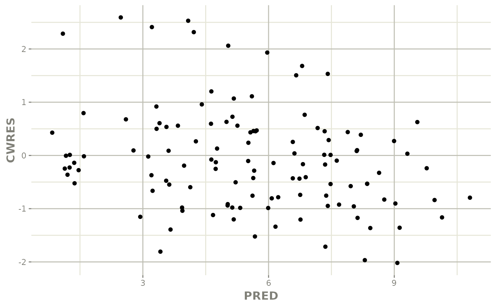

# Converting Monolix fit to nlmixr2 fit

``` r

library(monolix2rx)
```

### Creating a nlmixr2 compatible model

Unlike `nonmem2rx`, the residuals specification can be converted more
efficiently to the nlmixr2 residual syntax.

## Example

``` r

library(babelmixr2) # will re-export much of monolix2rx

# You use the path to the monolix mlxtran file

# In this case we will us the theophylline project included in monolix2rx
pkgTheo <- system.file("theo/theophylline_project.mlxtran", package="monolix2rx")

# Note you have to setup monolix2rx to use the model library or save the model as a separate file
mod <- monolix2rx(pkgTheo)
#> ℹ integrated model file 'oral1_1cpt_kaVCl.txt' into mlxtran object
#> ℹ updating model values to final parameter estimates
#> ℹ done
#> ℹ reading run info (# obs, doses, Monolix Version, etc) from summary.txt
#> ℹ done
#> ℹ reading covariance from FisherInformation/covarianceEstimatesLin.txt
#> ℹ done
#> Warning in .dataRenameFromMlxtran(data, .mlxtran): NAs introduced by coercion
#> ℹ imported monolix and translated to rxode2 compatible data ($monolixData)
#> ℹ imported monolix ETAS (_SAEM) imported to rxode2 compatible data ($etaData)
#> ℹ imported monolix pred/ipred data to compare ($predIpredData)
#> ℹ solving ipred problem
#> ℹ done
#> ℹ solving pred problem
#> ℹ done

print(mod)
#>  ── rxode2-based free-form 2-cmt ODE model ────────────────────────────────────── 
#>  ── Initalization: ──  
#> Fixed Effects ($theta): 
#>      ka_pop       V_pop      Cl_pop           a           b 
#>  0.42699448 -0.78635157 -3.21457598  0.43327956  0.05425953 
#> 
#> Omega ($omega): 
#>           omega_ka    omega_V   omega_Cl
#> omega_ka 0.4503145 0.00000000 0.00000000
#> omega_V  0.0000000 0.01594701 0.00000000
#> omega_Cl 0.0000000 0.00000000 0.07323701
#> 
#> States ($state or $stateDf): 
#>   Compartment Number Compartment Name
#> 1                  1            depot
#> 2                  2          central
#>  ── μ-referencing ($muRefTable): ──  
#>    theta      eta level
#> 1 ka_pop omega_ka    id
#> 2  V_pop  omega_V    id
#> 3 Cl_pop omega_Cl    id
#> 
#>  ── Model (Normalized Syntax): ── 
#> function() {
#>     description <- "The administration is extravascular with a first order absorption (rate constant ka).\nThe PK model has one compartment (volume V) and a linear elimination (clearance Cl).\nThis has been modified so that it will run without the model library"
#>     dfObs <- 120
#>     dfSub <- 12
#>     thetaMat <- lotri({
#>         ka_pop ~ 0.09785
#>         V_pop ~ c(0.00082606, 0.00041937)
#>         Cl_pop ~ c(-4.2833e-05, -6.7957e-06, 1.1318e-05)
#>         omega_ka ~ c(omega_ka = 0.022259)
#>         omega_V ~ c(omega_ka = -7.6443e-05, omega_V = 0.0014578)
#>         omega_Cl ~ c(omega_ka = 3.062e-06, omega_V = -1.2912e-05, 
#>             omega_Cl = 0.0039578)
#>         a ~ c(omega_ka = -0.0001227, omega_V = -6.5914e-05, omega_Cl = -0.00041194, 
#>             a = 0.015333)
#>         b ~ c(omega_ka = -1.3886e-05, omega_V = -3.1105e-05, 
#>             omega_Cl = 5.2805e-05, a = -0.0026458, b = 0.00056232)
#>     })
#>     validation <- c("ipred relative difference compared to Monolix ipred: 0.04%; 95% percentile: (0%,0.52%); rtol=0.00038", 
#>         "ipred absolute difference compared to Monolix ipred: 95% percentile: (0.000362, 0.00848); atol=0.00254", 
#>         "pred relative difference compared to Monolix pred: 0%; 95% percentile: (0%,0%); rtol=6.6e-07", 
#>         "pred absolute difference compared to Monolix pred: 95% percentile: (1.6e-07, 1.27e-05); atol=3.66e-06", 
#>         "iwres relative difference compared to Monolix iwres: 0%; 95% percentile: (0.06%,32.22%); rtol=0.0153", 
#>         "iwres absolute difference compared to Monolix pred: 95% percentile: (0.000403, 0.0138); atol=0.00305")
#>     ini({
#>         ka_pop <- 0.426994483535611
#>         V_pop <- -0.786351566327091
#>         Cl_pop <- -3.21457597916301
#>         a <- c(0, 0.433279557549051)
#>         b <- c(0, 0.0542595276206251)
#>         omega_ka ~ 0.450314511978718
#>         omega_V ~ 0.0159470121255372
#>         omega_Cl ~ 0.0732370098834837
#>     })
#>     model({
#>         cmt(depot)
#>         cmt(central)
#>         ka <- exp(ka_pop + omega_ka)
#>         V <- exp(V_pop + omega_V)
#>         Cl <- exp(Cl_pop + omega_Cl)
#>         d/dt(depot) <- -ka * depot
#>         d/dt(central) <- +ka * depot - Cl/V * central
#>         Cc <- central/V
#>         CONC <- Cc
#>         CONC ~ add(a) + prop(b) + combined1()
#>     })
#> }
```

### Converting the model to a nlmixr2 fit

Once you have a
[`rxode2()`](https://nlmixr2.github.io/rxode2/reference/rxode2.html)
model that:

- Qualifies against the NONMEM model,

- Has `nlmixr2` compatible residuals

You can then convert it to a `nlmixr2` fit object with `babelmixr2`:

``` r

library(babelmixr2)

fit <- as.nlmixr2(mod)
#> → loading into symengine environment...
#> → pruning branches (`if`/`else`) of full model...
#> ✔ done
#> → finding duplicate expressions in EBE model...
#> [====|====|====|====|====|====|====|====|====|====] 0:00:00
#> → optimizing duplicate expressions in EBE model...
#> [====|====|====|====|====|====|====|====|====|====] 0:00:00
#> → compiling EBE model...
#> ✔ done
#> rxode2 5.1.4 using 2 threads (see ?getRxThreads)
#>   no cache: create with `rxCreateCache()`
#> → Calculating residuals/tables
#> ✔ done
#> ℹ monolix parameter history integrated into fit object

# If you want you can use nlmixr2, to add cwres to this fit:
fit <- addCwres(fit)
#> → loading into symengine environment...
#> → pruning branches (`if`/`else`) of full model...
#> ✔ done
#> [====|====|====|====|====|====|====|====|====|====] 0:00:00
#> → calculate sensitivities
#> [====|====|====|====|====|====|====|====|====|====] 0:00:00
#> → calculate ∂(f)/∂(η)
#> [====|====|====|====|====|====|====|====|====|====] 0:00:00
#> → calculate ∂(R²)/∂(η)
#> [====|====|====|====|====|====|====|====|====|====] 0:00:00
#> → finding duplicate expressions in inner model...
#> [====|====|====|====|====|====|====|====|====|====] 0:00:00
#> → optimizing duplicate expressions in inner model...
#> [====|====|====|====|====|====|====|====|====|====] 0:00:00 
#> 
#> [====|====|====|====|====|====|====|====|====|====] 0:00:00 
#> 
#> [====|====|====|====|====|====|====|====|====|====] 0:00:00
#> → finding duplicate expressions in EBE model...
#> [====|====|====|====|====|====|====|====|====|====] 0:00:00
#> → optimizing duplicate expressions in EBE model...
#> [====|====|====|====|====|====|====|====|====|====] 0:00:00
#> → compiling inner model...
#> ✔ done
#> → finding duplicate expressions in FD model...
#> [====|====|====|====|====|====|====|====|====|====] 0:00:00
#> → optimizing duplicate expressions in FD model...
#> [====|====|====|====|====|====|====|====|====|====] 0:00:00
#> → compiling EBE model...
#> ✔ done
#> → compiling events FD model...
#> ✔ done
#> → Calculating residuals/tables
#> ✔ done

library(ggplot2)
ggplot(fit, aes(PRED, CWRES)) +
  geom_point() + rxode2::rxTheme()
```


