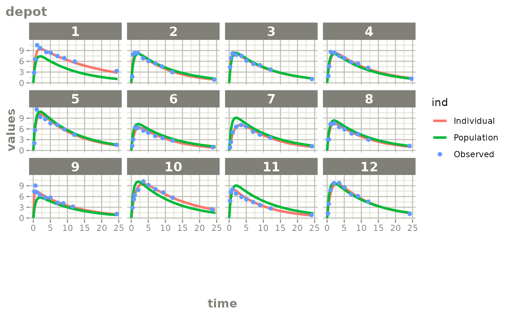

# Created Augmented pred/ipred plots with \`augPred()\`

This is a simple process to create individual predictions augmented with
more observations than was modeled. This allows smoother plots and a
better examination of the observed concentrations for an individual and
population.

## Step 1: Convert the `Monolix` model to `rxode2`:

``` r


library(monolix2rx)

# First we need the location of the monolix mlxtran file. Since we are
# running an example, we will use one of the built-in examples in
# `monolix2rx`
pkgTheo <- system.file("theo/theophylline_project.mlxtran", package="monolix2rx")
# You can use a control stream or other file. With the development
# version of `babelmixr2`, you can simply point to the listing file

mod <- monolix2rx(pkgTheo)
#> ℹ integrated model file 'oral1_1cpt_kaVCl.txt' into mlxtran object
#> ℹ updating model values to final parameter estimates
#> ℹ done
#> ℹ reading run info (# obs, doses, Monolix Version, etc) from summary.txt
#> ℹ done
#> ℹ reading covariance from FisherInformation/covarianceEstimatesLin.txt
#> ℹ done
#> Warning in .dataRenameFromMlxtran(data, .mlxtran): NAs introduced by coercion
#> ℹ imported monolix and translated to rxode2 compatible data ($monolixData)
#> ℹ imported monolix ETAS (_SAEM) imported to rxode2 compatible data ($etaData)
#> ℹ imported monolix pred/ipred data to compare ($predIpredData)
#> ℹ solving ipred problem
#> ℹ done
#> ℹ solving pred problem
#> ℹ done
```

## Step 2: convert the `rxode2` model to `nlmixr2`

You can convert the model, `mod`, to a nlmixr2 fit object:

``` r

library(babelmixr2) # provides as.nlmixr2
fit <- as.nlmixr2(mod)
#> → loading into symengine environment...
#> → pruning branches (`if`/`else`) of full model...
#> ✔ done
#> → finding duplicate expressions in EBE model...
#> [====|====|====|====|====|====|====|====|====|====] 0:00:00
#> → optimizing duplicate expressions in EBE model...
#> [====|====|====|====|====|====|====|====|====|====] 0:00:00
#> → compiling EBE model...
#> ✔ done
#> rxode2 5.1.4 using 2 threads (see ?getRxThreads)
#>   no cache: create with `rxCreateCache()`
#> → Calculating residuals/tables
#> ✔ done
#> ℹ monolix parameter history integrated into fit object

fit
```

``` math
\begin{align*}
cmt({depot}) \\
cmt({central}) \\
{ka} & = \exp\left({ka\_pop}+{omega\_ka}\right) \\
{V} & = \exp\left({V\_pop}+{omega\_V}\right) \\
{Cl} & = \exp\left({Cl\_pop}+{omega\_Cl}\right) \\
\frac{d \: depot}{dt} & = -{ka} {\times} {depot} \\
\frac{d \: central}{dt} & = +{ka} {\times} {depot}-\frac{{Cl}}{{V}} {\times} {central} \\
{Cc} & = \frac{{central}}{{V}} \\
{CONC} & = {Cc} \\
{CONC} & \sim add({a})+prop({b})+combined1()
\end{align*}
```

## Step 3: Create and plot an augmented prediction

``` r

ap <- augPred(fit)

head(ap)
#>     values        ind id  time Endpoint
#> 1 0.000000 Individual  1 0.000    depot
#> 2 3.726962 Individual  1 0.250    depot
#> 3 6.030526 Individual  1 0.493    depot
#> 4 6.567601 Individual  1 0.570    depot
#> 5 8.414706 Individual  1 0.986    depot
#> 6 8.746028 Individual  1 1.120    depot

# This augpred looks odd:
plot(ap)
```


