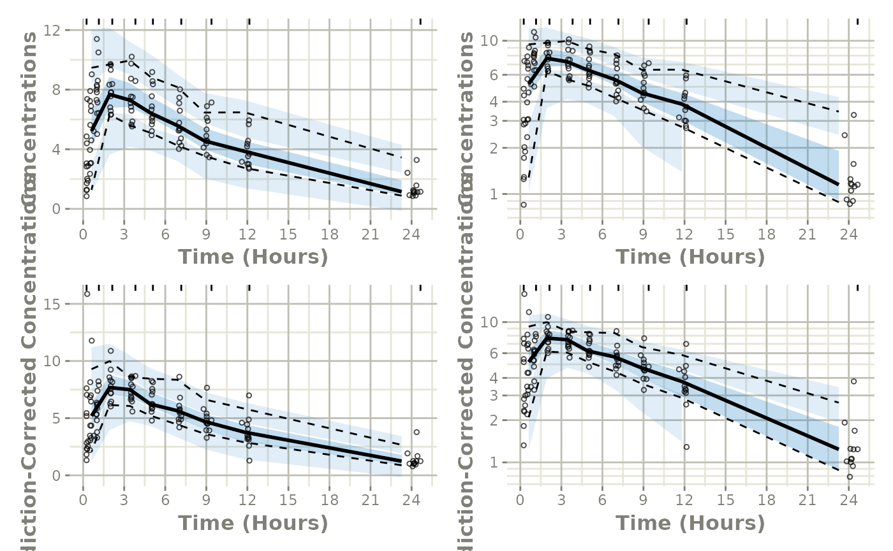

# Easily Create a VPC using monolix2rx

This shows an easy work-flow to create a VPC using a Monolix model:

## Step 1: Convert the `Monolix` model to `rxode2`:

``` r

library(babelmixr2)
library(monolix2rx)

# First we need the location of the monolix mlxtran file. Since we are
# running an example, we will use one of the built-in examples in
# `monolix2rx`
pkgTheo <- system.file("theo/theophylline_project.mlxtran", package="monolix2rx")
# You can use a control stream or other file. With the development
# version of `babelmixr2`, you can simply point to the listing file

mod <- monolix2rx(pkgTheo)
#> ℹ integrated model file 'oral1_1cpt_kaVCl.txt' into mlxtran object
#> ℹ updating model values to final parameter estimates
#> ℹ done
#> ℹ reading run info (# obs, doses, Monolix Version, etc) from summary.txt
#> ℹ done
#> ℹ reading covariance from FisherInformation/covarianceEstimatesLin.txt
#> ℹ done
#> Warning in .dataRenameFromMlxtran(data, .mlxtran): NAs introduced by coercion
#> ℹ imported monolix and translated to rxode2 compatible data ($monolixData)
#> ℹ imported monolix ETAS (_SAEM) imported to rxode2 compatible data ($etaData)
#> ℹ imported monolix pred/ipred data to compare ($predIpredData)
#> ℹ solving ipred problem
#> ℹ done
#> ℹ solving pred problem
#> ℹ done
```

## Step 2: convert the `rxode2` model to `nlmixr2`

You can convert the model, `mod`, to a nlmixr2 fit object:

``` r

fit <- as.nlmixr2(mod)
#> → loading into symengine environment...
#> → pruning branches (`if`/`else`) of full model...
#> ✔ done
#> → finding duplicate expressions in EBE model...
#> [====|====|====|====|====|====|====|====|====|====] 0:00:00
#> → optimizing duplicate expressions in EBE model...
#> [====|====|====|====|====|====|====|====|====|====] 0:00:00
#> → compiling EBE model...
#> ✔ done
#> rxode2 5.0.2 using 2 threads (see ?getRxThreads)
#>   no cache: create with `rxCreateCache()`
#> → Calculating residuals/tables
#> ✔ done
#> ℹ monolix parameter history integrated into fit object

fit
```

``` math
\begin{align*}
cmt({depot}) \\
cmt({central}) \\
{ka} & = \exp\left({ka\_pop}+{omega\_ka}\right) \\
{V} & = \exp\left({V\_pop}+{omega\_V}\right) \\
{Cl} & = \exp\left({Cl\_pop}+{omega\_Cl}\right) \\
\frac{d \: depot}{dt} & = -{ka} {\times} {depot} \\
\frac{d \: central}{dt} & = +{ka} {\times} {depot}-\frac{{Cl}}{{V}} {\times} {central} \\
{Cc} & = \frac{{central}}{{V}} \\
{CONC} & = {Cc} \\
{CONC} & \sim add({a})+prop({b})+combined1()
\end{align*}
```

## Step 3: Perform the VPC

From here we simply use
[`vpcPlot()`](https://nlmixr2.github.io/nlmixr2plot/reference/vpcPlot.html)
in conjunction with the `vpc` package to get the regular and
prediction-corrected VPCs and arrange them on a single plot:

``` r


library(ggplot2)
p1 <- vpcPlot(fit, show=list(obs_dv=TRUE))
#> Warning in filter_dv(obs, verbose): No software packages matched for filtering values, not filtering.
#>  Object class: other, data.frame
#>  Available filters: phoenix, nonmem
#> Warning in filter_dv(sim, verbose): No software packages matched for filtering values, not filtering.
#>  Object class: other, nlmixr2vpcSim, data.frame
#>  Available filters: phoenix, nonmem

p1 <- p1 + ylab("Concentrations") +
  rxode2::rxTheme() +
  xlab("Time (hr)") +
  xgxr::xgx_scale_x_time_units("hour", "hour")
#> Scale for x is already present.
#> Adding another scale for x, which will replace the existing scale.

p1a <- p1 + xgxr::xgx_scale_y_log10()
#> Scale for y is already present.
#> Adding another scale for y, which will replace the existing scale.

## A prediction-corrected VPC
p2 <- vpcPlot(fit, pred_corr = TRUE, show=list(obs_dv=TRUE))
#> Warning in filter_dv(obs, verbose): No software packages matched for filtering values, not filtering.
#>  Object class: other, data.frame
#>  Available filters: phoenix, nonmem
#> Warning in filter_dv(obs, verbose): No software packages matched for filtering values, not filtering.
#>  Object class: other, nlmixr2vpcSim, data.frame
#>  Available filters: phoenix, nonmem
p2 <- p2 + ylab("Prediction-Corrected Concentrations") +
  rxode2::rxTheme() +
  xlab("Time (hr)") +
  xgxr::xgx_scale_x_time_units("hour", "hour")
#> Scale for x is already present.
#> Adding another scale for x, which will replace the existing scale.

p2a <- p2 + xgxr::xgx_scale_y_log10()
#> Scale for y is already present.
#> Adding another scale for y, which will replace the existing scale.


library(patchwork)
(p1 * p1a) / (p2 * p2a)
#> Warning in transformation$transform(x): NaNs produced
#> Warning in ggplot2::scale_y_log10(..., breaks = breaks, minor_breaks =
#> minor_breaks, : log-10 transformation introduced infinite
#> values.
#> Warning: Removed 1 row containing missing values or values outside the scale range
#> (`geom_ribbon()`).
#> Warning in transformation$transform(x): NaNs produced
#> Warning in ggplot2::scale_y_log10(..., breaks = breaks, minor_breaks =
#> minor_breaks, : log-10 transformation introduced infinite
#> values.
#> Warning: Removed 1 row containing missing values or values outside the scale range
#> (`geom_ribbon()`).
```


