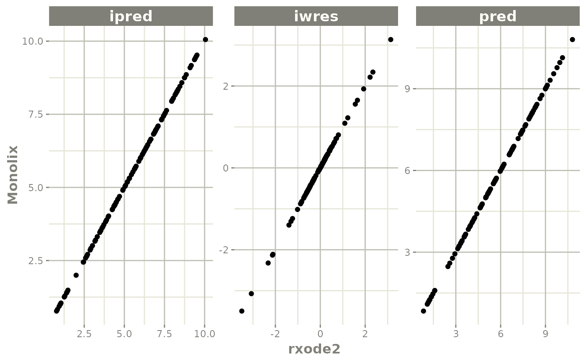
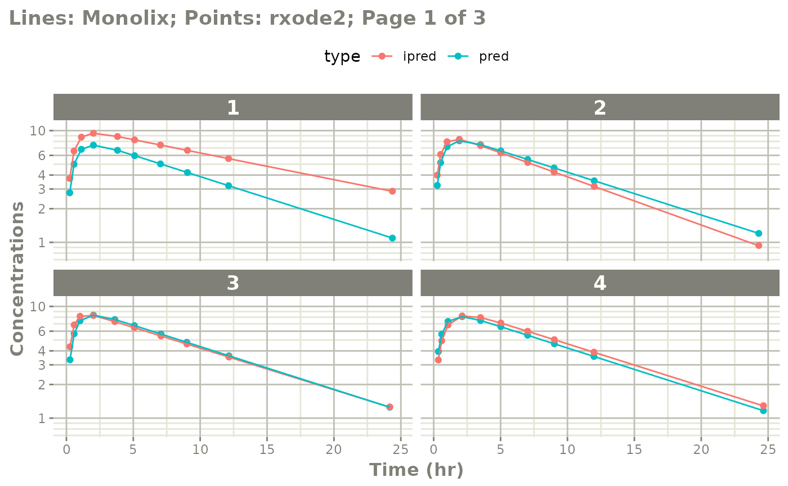
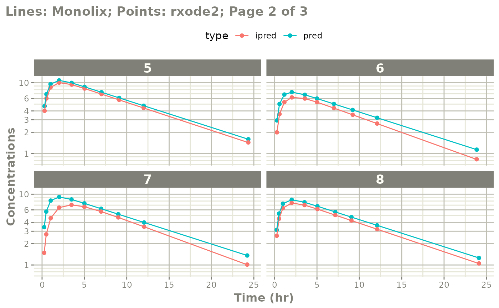
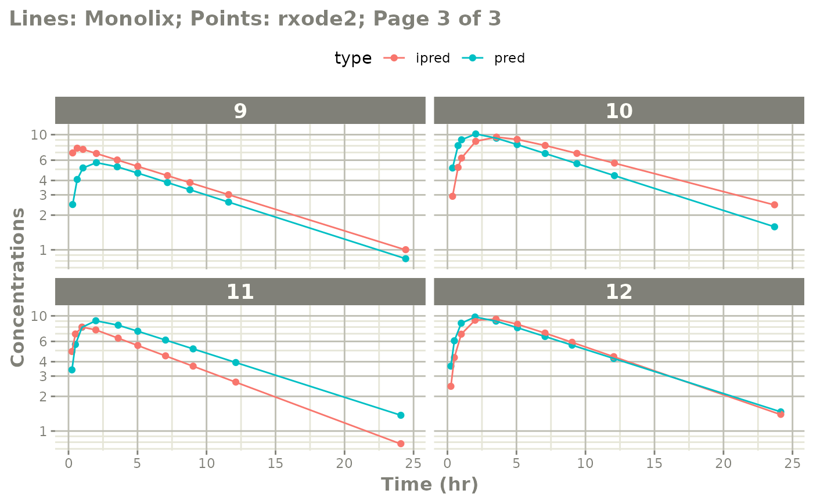

# Qualify rxode2 model against Monolix

``` r


library(monolix2rx)
# You use the path to the monolix mlxtran file

# In this case we will us the theophylline project included in monolix2rx
pkgTheo <- system.file("theo/theophylline_project.mlxtran", package="monolix2rx")

# Note you have to setup monolix2rx to use the model library or save
# the model as a separate file
mod <- monolix2rx(pkgTheo)
#> ℹ integrated model file 'oral1_1cpt_kaVCl.txt' into mlxtran object
#> ℹ updating model values to final parameter estimates
#> ℹ done
#> ℹ reading run info (# obs, doses, Monolix Version, etc) from summary.txt
#> ℹ done
#> ℹ reading covariance from FisherInformation/covarianceEstimatesLin.txt
#> ℹ done
#> Warning in .dataRenameFromMlxtran(data, .mlxtran): NAs introduced by coercion
#> ℹ imported monolix and translated to rxode2 compatible data ($monolixData)
#> ℹ imported monolix ETAS (_SAEM) imported to rxode2 compatible data ($etaData)
#> ℹ imported monolix pred/ipred data to compare ($predIpredData)
#> ℹ solving ipred problem
#> ℹ done
#> ℹ solving pred problem
#> ℹ done

print(mod)
#>  ── rxode2-based free-form 2-cmt ODE model ────────────────────────────────────── 
#>  ── Initalization: ──  
#> Fixed Effects ($theta): 
#>      ka_pop       V_pop      Cl_pop           a           b 
#>  0.42699448 -0.78635157 -3.21457598  0.43327956  0.05425953 
#> 
#> Omega ($omega): 
#>           omega_ka    omega_V   omega_Cl
#> omega_ka 0.4503145 0.00000000 0.00000000
#> omega_V  0.0000000 0.01594701 0.00000000
#> omega_Cl 0.0000000 0.00000000 0.07323701
#> 
#> States ($state or $stateDf): 
#>   Compartment Number Compartment Name
#> 1                  1            depot
#> 2                  2          central
#>  ── μ-referencing ($muRefTable): ──  
#>    theta      eta level
#> 1 ka_pop omega_ka    id
#> 2  V_pop  omega_V    id
#> 3 Cl_pop omega_Cl    id
#> 
#>  ── Model (Normalized Syntax): ── 
#> function() {
#>     description <- "The administration is extravascular with a first order absorption (rate constant ka).\nThe PK model has one compartment (volume V) and a linear elimination (clearance Cl).\nThis has been modified so that it will run without the model library"
#>     dfObs <- 120
#>     dfSub <- 12
#>     thetaMat <- lotri({
#>         ka_pop ~ 0.09785
#>         V_pop ~ c(0.00082606, 0.00041937)
#>         Cl_pop ~ c(-4.2833e-05, -6.7957e-06, 1.1318e-05)
#>         omega_ka ~ c(omega_ka = 0.022259)
#>         omega_V ~ c(omega_ka = -7.6443e-05, omega_V = 0.0014578)
#>         omega_Cl ~ c(omega_ka = 3.062e-06, omega_V = -1.2912e-05, 
#>             omega_Cl = 0.0039578)
#>         a ~ c(omega_ka = -0.0001227, omega_V = -6.5914e-05, omega_Cl = -0.00041194, 
#>             a = 0.015333)
#>         b ~ c(omega_ka = -1.3886e-05, omega_V = -3.1105e-05, 
#>             omega_Cl = 5.2805e-05, a = -0.0026458, b = 0.00056232)
#>     })
#>     validation <- c("ipred relative difference compared to Monolix ipred: 0.04%; 95% percentile: (0%,0.52%); rtol=0.00038", 
#>         "ipred absolute difference compared to Monolix ipred: 95% percentile: (0.000362, 0.00848); atol=0.00254", 
#>         "pred relative difference compared to Monolix pred: 0%; 95% percentile: (0%,0%); rtol=6.6e-07", 
#>         "pred absolute difference compared to Monolix pred: 95% percentile: (1.6e-07, 1.27e-05); atol=3.66e-06", 
#>         "iwres relative difference compared to Monolix iwres: 0%; 95% percentile: (0.06%,32.22%); rtol=0.0153", 
#>         "iwres absolute difference compared to Monolix pred: 95% percentile: (0.000403, 0.0138); atol=0.00305")
#>     ini({
#>         ka_pop <- 0.426994483535611
#>         V_pop <- -0.786351566327091
#>         Cl_pop <- -3.21457597916301
#>         a <- c(0, 0.433279557549051)
#>         b <- c(0, 0.0542595276206251)
#>         omega_ka ~ 0.450314511978718
#>         omega_V ~ 0.0159470121255372
#>         omega_Cl ~ 0.0732370098834837
#>     })
#>     model({
#>         cmt(depot)
#>         cmt(central)
#>         ka <- exp(ka_pop + omega_ka)
#>         V <- exp(V_pop + omega_V)
#>         Cl <- exp(Cl_pop + omega_Cl)
#>         d/dt(depot) <- -ka * depot
#>         d/dt(central) <- +ka * depot - Cl/V * central
#>         Cc <- central/V
#>         CONC <- Cc
#>         CONC ~ add(a) + prop(b) + combined1()
#>     })
#> }
```

### Comparing differences between `Monolix` and `rxode2`

You may wish to see where the differences in predictions are between
Monolix and rxode2.

The `rxode2` generated outputs are compared with the `Monolix` generated
outputs for the following items:

- **Population Predictions:** this shows if the model translation is
  adequate to simulate general trends; This will validate structural
  model’s population parameters coupled with the model structure.

- **Individual Predictions:** this shows if the model translation is
  able to replicate the same values over all the subjects within the
  modeling data-set. This validates the model can reproduce the between
  subject variability observed in the study.

- **Individual Weighted Residuals:** this is one step further than the
  individual parameter validation, it couples the individual
  predictions, the observations and the residual specification to
  generate the individual weighted residuals. This is included to be
  consistent with the `nonmem2rx` residuals. However, since this is not
  needed to manually adjust the residual errors, this simply looks at if
  the errors were converted correctly.

**Note:** the only part that is not validated with these three metrics
is the between subject covariance matrix, `omega`. We assume this is
correct as long as it is read in correctly.

## Comparing numerically

If you want numerical differences, you can also get these from the
modified returned `ui` object. For the rtol, atol as follows you have:

``` r

mod$iwresAtol
#>         50% 
#> 0.003054349
mod$iwresRtol
#>        50% 
#> 0.01526897
mod$ipredAtol
#>         50% 
#> 0.002537436
mod$ipredRtol
#>          50% 
#> 0.0003802867
mod$predAtol
#>          50% 
#> 3.657152e-06
mod$predAtol
#>          50% 
#> 3.657152e-06
```

You can see they do not exactly match but are very close (I would say
they validate). However you can explore these difference further if you
wish by looking at the `ipredCompare` and `predCompare` datasets:

``` r

head(mod$iwresCompare)
#>   id  time monolixIwres        iwres  cmt
#> 1  1  0.25 -1.397760000 -1.395682322 CONC
#> 2  1  0.57  0.000121543  0.003040162 CONC
#> 3  1  1.12  1.928970000  1.932039320 CONC
#> 4  1 12.12  0.440294000  0.431149277 CONC
#> 5  1  2.02  0.196493000  0.198287572 CONC
#> 6  1 24.37  0.713742000  0.699508374 CONC

head(mod$ipredCompare)
#>   id  time monolixIpred    ipred  cmt
#> 1  1  0.25      3.72839 3.726960 CONC
#> 2  1  0.57      6.56990 6.567599 CONC
#> 3  1  1.12      8.74855 8.746027 CONC
#> 4  1 12.12      5.61508 5.621679 CONC
#> 5  1  2.02      9.47386 9.472175 CONC
#> 6  1 24.37      2.85999 2.868060 CONC

head(mod$predCompare)
#>   id  time monolixPred  cmt     pred
#> 1  1  0.25     2.77640 CONC 2.776402
#> 2  1  0.57     4.99610 CONC 4.996088
#> 3  1  1.12     6.80090 CONC 6.800893
#> 4  1 12.12     3.21554 CONC 3.215548
#> 5  1  2.02     7.41259 CONC 7.412585
#> 6  1 24.37     1.09158 CONC 1.091582
```

In these cases you can see that Monolix seems to round the values to 5
digits, while `rxode2` keeps everything since it is solved in R
directly.

Note this is the **observation data only** that is compared. Dosing
predictions are excluded from these comparisons.

You can also explore the Monolix translated input dataset that was used
to make the validation predictions (dosing and observations) by the
`$monolixData` item:

``` r

head(mod$monolixData) # with nlme loaded you can also use getData(mod)
#>   id  amt time    dv WEIGHT SEX  cmt admd
#> 1  1 4.02 0.00    NA   79.6  NA <NA>   NA
#> 2  1   NA 0.25  2.84   79.6  NA <NA>   NA
#> 3  1   NA 0.57  6.57   79.6  NA <NA>   NA
#> 4  1   NA 1.12 10.50   79.6  NA <NA>   NA
#> 5  1   NA 2.02  9.66   79.6  NA <NA>   NA
#> 6  1   NA 3.82  8.58   79.6  NA <NA>   NA
```

## Comparing visually

The easiest way to visually compare the differences is by the plot
method:

``` r


plot(mod) # for general plot
```



``` r


# you can also see individual comparisons
plot(mod, log="y", ncol=2, nrow=2,
     xlab="Time (hr)", ylab="Concentrations",
     page=1)
```



``` r


# If you want all pages you could use:
#
plot(mod, log="y", ncol=2, nrow=2,
     xlab="Time (hr)", ylab="Concentrations",
     page=TRUE)
```



## Notes on validation

The validation of the model uses the best data available for Monolix
estimates. This is:

- `theta` or population parameters
- `eta` or individual parameters

The `omega` and `sigma` matrices are captured. When the nlmixr2 model is
fully qualified, the `IWRES` validation ensures the residual errors are
specified correctly. Otherwise `omega` and `sigma` values do not
contribute to the validation. Also the overall covariance is captured,
but not used in the validation.
