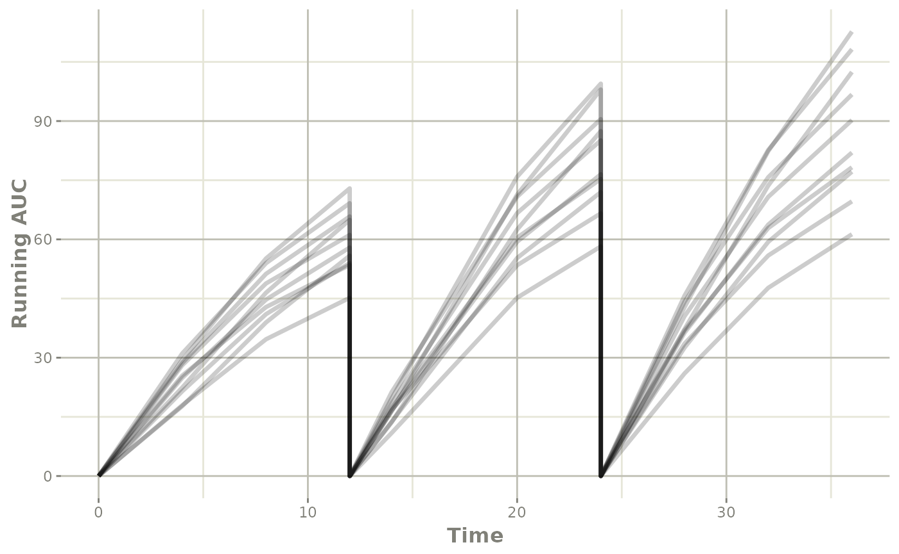

# Simulate Derived Variables from imported Monolix model

This page shows a simple work-flow for directly simulating a different
dosing paradigm with new derived items, in this case `AUC`.

## Step 1: Import the model

``` r

library(monolix2rx)
library(rxode2)


# First we need the location of the nonmem control stream Since we are running an example, we will use one of the built-in examples in `nonmem2rx`
ctlFile <- system.file("mods/cpt/runODE032.ctl", package="nonmem2rx")
# You can use a control stream or other file. With the development
# version of `babelmixr2`, you can simply point to the listing file

# You use the path to the monolix mlxtran file

# In this case we will us the theophylline project included in monolix2rx
pkgTheo <- system.file("theo/theophylline_project.mlxtran", package="monolix2rx")

# Note you have to setup monolix2rx to use the model library or save
# the model as a separate file
mod <- monolix2rx(pkgTheo)
#> ℹ integrated model file 'oral1_1cpt_kaVCl.txt' into mlxtran object
#> ℹ updating model values to final parameter estimates
#> ℹ done
#> ℹ reading run info (# obs, doses, Monolix Version, etc) from summary.txt
#> ℹ done
#> ℹ reading covariance from FisherInformation/covarianceEstimatesLin.txt
#> ℹ done
#> Warning in .dataRenameFromMlxtran(data, .mlxtran): NAs introduced by coercion
#> ℹ imported monolix and translated to rxode2 compatible data ($monolixData)
#> ℹ imported monolix ETAS (_SAEM) imported to rxode2 compatible data ($etaData)
#> ℹ imported monolix pred/ipred data to compare ($predIpredData)
#> ℹ solving ipred problem
#> ℹ done
#> ℹ solving pred problem
#> ℹ done

print(mod)
#>  ── rxode2-based free-form 2-cmt ODE model ────────────────────────────────────── 
#>  ── Initalization: ──  
#> Fixed Effects ($theta): 
#>      ka_pop       V_pop      Cl_pop           a           b 
#>  0.42699448 -0.78635157 -3.21457598  0.43327956  0.05425953 
#> 
#> Omega ($omega): 
#>           omega_ka    omega_V   omega_Cl
#> omega_ka 0.4503145 0.00000000 0.00000000
#> omega_V  0.0000000 0.01594701 0.00000000
#> omega_Cl 0.0000000 0.00000000 0.07323701
#> 
#> States ($state or $stateDf): 
#>   Compartment Number Compartment Name
#> 1                  1            depot
#> 2                  2          central
#>  ── μ-referencing ($muRefTable): ──  
#>    theta      eta level
#> 1 ka_pop omega_ka    id
#> 2  V_pop  omega_V    id
#> 3 Cl_pop omega_Cl    id
#> 
#>  ── Model (Normalized Syntax): ── 
#> function() {
#>     description <- "The administration is extravascular with a first order absorption (rate constant ka).\nThe PK model has one compartment (volume V) and a linear elimination (clearance Cl).\nThis has been modified so that it will run without the model library"
#>     dfObs <- 120
#>     dfSub <- 12
#>     thetaMat <- lotri({
#>         ka_pop ~ 0.09785
#>         V_pop ~ c(0.00082606, 0.00041937)
#>         Cl_pop ~ c(-4.2833e-05, -6.7957e-06, 1.1318e-05)
#>         omega_ka ~ c(omega_ka = 0.022259)
#>         omega_V ~ c(omega_ka = -7.6443e-05, omega_V = 0.0014578)
#>         omega_Cl ~ c(omega_ka = 3.062e-06, omega_V = -1.2912e-05, 
#>             omega_Cl = 0.0039578)
#>         a ~ c(omega_ka = -0.0001227, omega_V = -6.5914e-05, omega_Cl = -0.00041194, 
#>             a = 0.015333)
#>         b ~ c(omega_ka = -1.3886e-05, omega_V = -3.1105e-05, 
#>             omega_Cl = 5.2805e-05, a = -0.0026458, b = 0.00056232)
#>     })
#>     validation <- c("ipred relative difference compared to Monolix ipred: 0.04%; 95% percentile: (0%,0.52%); rtol=0.00038", 
#>         "ipred absolute difference compared to Monolix ipred: 95% percentile: (0.000362, 0.00848); atol=0.00254", 
#>         "pred relative difference compared to Monolix pred: 0%; 95% percentile: (0%,0%); rtol=6.6e-07", 
#>         "pred absolute difference compared to Monolix pred: 95% percentile: (1.6e-07, 1.27e-05); atol=3.66e-06", 
#>         "iwres relative difference compared to Monolix iwres: 0%; 95% percentile: (0.06%,32.22%); rtol=0.0153", 
#>         "iwres absolute difference compared to Monolix pred: 95% percentile: (0.000403, 0.0138); atol=0.00305")
#>     ini({
#>         ka_pop <- 0.426994483535611
#>         V_pop <- -0.786351566327091
#>         Cl_pop <- -3.21457597916301
#>         a <- c(0, 0.433279557549051)
#>         b <- c(0, 0.0542595276206251)
#>         omega_ka ~ 0.450314511978718
#>         omega_V ~ 0.0159470121255372
#>         omega_Cl ~ 0.0732370098834837
#>     })
#>     model({
#>         cmt(depot)
#>         cmt(central)
#>         ka <- exp(ka_pop + omega_ka)
#>         V <- exp(V_pop + omega_V)
#>         Cl <- exp(Cl_pop + omega_Cl)
#>         d/dt(depot) <- -ka * depot
#>         d/dt(central) <- +ka * depot - Cl/V * central
#>         Cc <- central/V
#>         CONC <- Cc
#>         CONC ~ add(a) + prop(b) + combined1()
#>     })
#> }
```

## Step 2: Add AUC calculation

The concentration in this case is the `Cc` from the model, a trick to
get the `AUC` is to have an additional ODE `d/dt(AUC) <- Cc` and use
some reset to get it per dosing period.

However, this additional parameter is not part of the original model.
The calculation of AUC would depend on the number of observations in
your model, and for sparse data wouldn’t be terribly accurate.

One thing you can do is to use model piping append `d/dt(AUC) <- Cc` to
the imported model:

``` r

modAuc <- mod %>%
  model(d/dt(AUC) <- Cc, append=TRUE)
#> → significant model change detected
#> → kept in model: '$monolixData'
#> → removed from model: '$admd', '$etaData', '$ipredAtol', '$ipredCompare', '$ipredRtol', '$iwresAtol', '$iwresCompare', '$iwresRtol', '$mlxtran', '$predAtol', '$predCompare', '$predIpredData', '$predRtol'

modAuc
#>  ── rxode2-based free-form 3-cmt ODE model ────────────────────────────────────── 
#>  ── Initalization: ──  
#> Fixed Effects ($theta): 
#>      ka_pop       V_pop      Cl_pop           a           b 
#>  0.42699448 -0.78635157 -3.21457598  0.43327956  0.05425953 
#> 
#> Omega ($omega): 
#>           omega_ka    omega_V   omega_Cl
#> omega_ka 0.4503145 0.00000000 0.00000000
#> omega_V  0.0000000 0.01594701 0.00000000
#> omega_Cl 0.0000000 0.00000000 0.07323701
#> 
#> States ($state or $stateDf): 
#>   Compartment Number Compartment Name
#> 1                  1            depot
#> 2                  2          central
#> 3                  3              AUC
#>  ── μ-referencing ($muRefTable): ──  
#>    theta      eta level
#> 1 ka_pop omega_ka    id
#> 2  V_pop  omega_V    id
#> 3 Cl_pop omega_Cl    id
#> 
#>  ── Model (Normalized Syntax): ── 
#> function() {
#>     description <- "The administration is extravascular with a first order absorption (rate constant ka).\nThe PK model has one compartment (volume V) and a linear elimination (clearance Cl).\nThis has been modified so that it will run without the model library"
#>     dfObs <- 120
#>     dfSub <- 12
#>     thetaMat <- lotri({
#>         ka_pop ~ 0.09785
#>         V_pop ~ c(0.00082606, 0.00041937)
#>         Cl_pop ~ c(-4.2833e-05, -6.7957e-06, 1.1318e-05)
#>         omega_ka ~ c(omega_ka = 0.022259)
#>         omega_V ~ c(omega_ka = -7.6443e-05, omega_V = 0.0014578)
#>         omega_Cl ~ c(omega_ka = 3.062e-06, omega_V = -1.2912e-05, 
#>             omega_Cl = 0.0039578)
#>         a ~ c(omega_ka = -0.0001227, omega_V = -6.5914e-05, omega_Cl = -0.00041194, 
#>             a = 0.015333)
#>         b ~ c(omega_ka = -1.3886e-05, omega_V = -3.1105e-05, 
#>             omega_Cl = 5.2805e-05, a = -0.0026458, b = 0.00056232)
#>     })
#>     validation <- c("ipred relative difference compared to Monolix ipred: 0.04%; 95% percentile: (0%,0.52%); rtol=0.00038", 
#>         "ipred absolute difference compared to Monolix ipred: 95% percentile: (0.000362, 0.00848); atol=0.00254", 
#>         "pred relative difference compared to Monolix pred: 0%; 95% percentile: (0%,0%); rtol=6.6e-07", 
#>         "pred absolute difference compared to Monolix pred: 95% percentile: (1.6e-07, 1.27e-05); atol=3.66e-06", 
#>         "iwres relative difference compared to Monolix iwres: 0%; 95% percentile: (0.06%,32.22%); rtol=0.0153", 
#>         "iwres absolute difference compared to Monolix pred: 95% percentile: (0.000403, 0.0138); atol=0.00305")
#>     ini({
#>         ka_pop <- 0.426994483535611
#>         V_pop <- -0.786351566327091
#>         Cl_pop <- -3.21457597916301
#>         a <- c(0, 0.433279557549051)
#>         b <- c(0, 0.0542595276206251)
#>         omega_ka ~ 0.450314511978718
#>         omega_V ~ 0.0159470121255372
#>         omega_Cl ~ 0.0732370098834837
#>     })
#>     model({
#>         cmt(depot)
#>         cmt(central)
#>         ka <- exp(ka_pop + omega_ka)
#>         V <- exp(V_pop + omega_V)
#>         Cl <- exp(Cl_pop + omega_Cl)
#>         d/dt(depot) <- -ka * depot
#>         d/dt(central) <- +ka * depot - Cl/V * central
#>         Cc <- central/V
#>         CONC <- Cc
#>         CONC ~ add(a) + prop(b) + combined1()
#>         d/dt(AUC) <- Cc
#>     })
#> }
```

You can also use `append=NA` to pre-pend or `append=f` to put the ODE
right after the `f` line in the model.

## Step 3: Setup event table to calculate the AUC for a different dosing paradigm:

Lets say that in this case instead of a single dose, we want to see what
the concentration profile is with a single day of BID dosing. In this
case is done by creating a [quick event
table](https://nlmixr2.github.io/rxode2/articles/rxode2-event-table.html).

In this case since we are also wanting `AUC` per dosing period, you can
add a reset dose to the `AUC` compartment every time a dose is given (so
it will only track the AUC of the current dose):

``` r

ev <- et(amt=4, ii=12, until=24) %>%
  et(amt=0, ii=12, until=24, cmt="AUC", evid=5) %>% # replace AUC with zero at dosing
  et(c(0, 4, 8, 11.999, 12, 12.01, 14, 20, 23.999, 24, 24.001, 28, 32, 36)) %>%
  et(id=1:10)
```

## Step 4: Solve using `rxode2`

In this step, we solve the model with the new event table for the 10
subjects:

``` r

s <- rxSolve(modAuc, ev)
#> ℹ using locf interpolation like Monolix, specify directly to change
#> ℹ using Monolix specified atol=1e-06
#> ℹ using Monolix specified rtol=1e-06
#> ℹ Since Monolix doesn't use ssRtol, set ssRtol=100
#> ℹ Since Monolix doesn't use ssRtol, set ssAtol=100
#> ℹ Since Monolix uses a set number of doses for steady state use maxSS=8, minSS=7
```

Note that since this derived from a `nonmem2rx` model, the default
solving will match the tolerances and methods specified in your `NONMEM`
model.

## Step 5: Exploring the simulation (by plotting), and summarizing (dplyr)

This solved object acts the same as any other `rxode2` solved object, so
you can use the [`plot()`](https://rdrr.io/r/graphics/plot.default.html)
function to see the individual running AUC profiles you simulated:

``` r

library(ggplot2)
plot(s, AUC) +
  ylab("Running AUC")
```



You can also select the points near the dosing to get the AUC for the
interval:

``` r

library(dplyr)
#> 
#> Attaching package: 'dplyr'
#> The following objects are masked from 'package:data.table':
#> 
#>     between, first, last
#> The following objects are masked from 'package:stats':
#> 
#>     filter, lag
#> The following objects are masked from 'package:base':
#> 
#>     intersect, setdiff, setequal, union
s %>% filter(time %in% c(11.999,  23.999)) %>%
  mutate(time=round(time)) %>%
  select(id, time, AUC)
#>    id time      AUC
#> 1   1   12 69.16917
#> 2   1   24 90.47544
#> 3   2   12 54.00355
#> 4   2   24 71.97559
#> 5   3   12 45.17990
#> 6   3   24 58.20645
#> 7   4   12 72.92601
#> 8   4   24 99.48172
#> 9   5   12 55.86934
#> 10  5   24 87.45050
#> 11  6   12 65.80535
#> 12  6   24 85.08856
#> 13  7   12 57.92611
#> 14  7   24 76.50091
#> 15  8   12 53.51476
#> 16  8   24 66.59538
#> 17  9   12 61.11976
#> 18  9   24 75.30758
#> 19 10   12 64.94732
#> 20 10   24 98.00602
```
