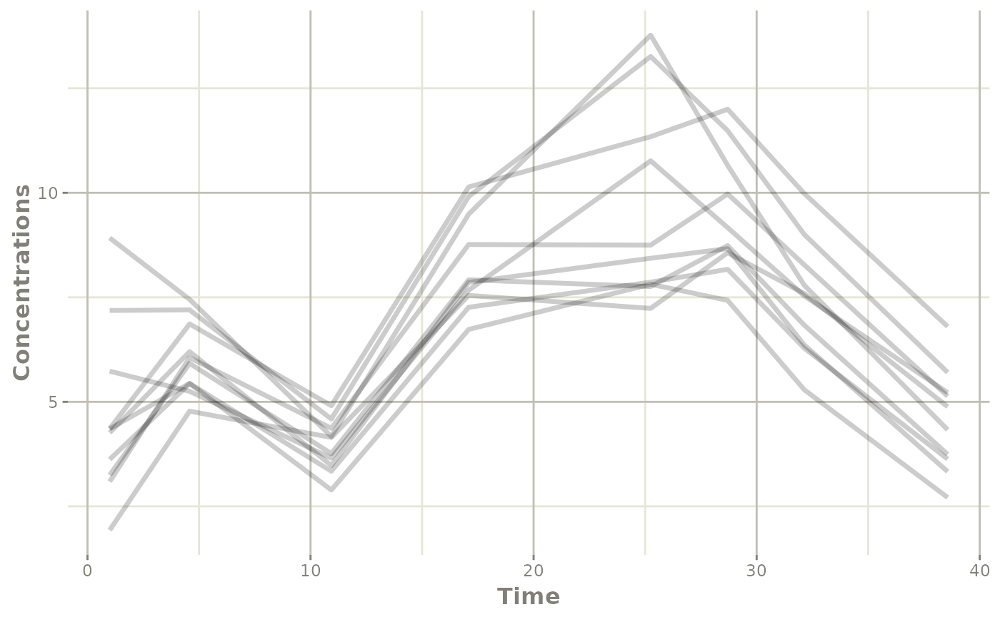

# Simulate New dosing from Monolix model

This page shows a simple work-flow for directly simulating a different
dosing paradigm than what was modeled.

## Step 1: Import the model

``` r

library(monolix2rx)
library(rxode2)

# You use the path to the monolix mlxtran file

# In this case we will us the theophylline project included in monolix2rx
pkgTheo <- system.file("theo/theophylline_project.mlxtran", package="monolix2rx")

# Note you have to setup monolix2rx to use the model library or save
# the model as a separate file
mod <- monolix2rx(pkgTheo)
#> ℹ integrated model file 'oral1_1cpt_kaVCl.txt' into mlxtran object
#> ℹ updating model values to final parameter estimates
#> ℹ done
#> ℹ reading run info (# obs, doses, Monolix Version, etc) from summary.txt
#> ℹ done
#> ℹ reading covariance from FisherInformation/covarianceEstimatesLin.txt
#> ℹ done
#> Warning in .dataRenameFromMlxtran(data, .mlxtran): NAs introduced by coercion
#> ℹ imported monolix and translated to rxode2 compatible data ($monolixData)
#> ℹ imported monolix ETAS (_SAEM) imported to rxode2 compatible data ($etaData)
#> ℹ imported monolix pred/ipred data to compare ($predIpredData)
#> ℹ solving ipred problem
#> ℹ done
#> ℹ solving pred problem
#> ℹ done

print(mod)
#>  ── rxode2-based free-form 2-cmt ODE model ────────────────────────────────────── 
#>  ── Initalization: ──  
#> Fixed Effects ($theta): 
#>      ka_pop       V_pop      Cl_pop           a           b 
#>  0.42699448 -0.78635157 -3.21457598  0.43327956  0.05425953 
#> 
#> Omega ($omega): 
#>           omega_ka    omega_V   omega_Cl
#> omega_ka 0.4503145 0.00000000 0.00000000
#> omega_V  0.0000000 0.01594701 0.00000000
#> omega_Cl 0.0000000 0.00000000 0.07323701
#> 
#> States ($state or $stateDf): 
#>   Compartment Number Compartment Name
#> 1                  1            depot
#> 2                  2          central
#>  ── μ-referencing ($muRefTable): ──  
#>    theta      eta level
#> 1 ka_pop omega_ka    id
#> 2  V_pop  omega_V    id
#> 3 Cl_pop omega_Cl    id
#> 
#>  ── Model (Normalized Syntax): ── 
#> function() {
#>     description <- "The administration is extravascular with a first order absorption (rate constant ka).\nThe PK model has one compartment (volume V) and a linear elimination (clearance Cl).\nThis has been modified so that it will run without the model library"
#>     dfObs <- 120
#>     dfSub <- 12
#>     thetaMat <- lotri({
#>         ka_pop ~ 0.09785
#>         V_pop ~ c(0.00082606, 0.00041937)
#>         Cl_pop ~ c(-4.2833e-05, -6.7957e-06, 1.1318e-05)
#>         omega_ka ~ c(omega_ka = 0.022259)
#>         omega_V ~ c(omega_ka = -7.6443e-05, omega_V = 0.0014578)
#>         omega_Cl ~ c(omega_ka = 3.062e-06, omega_V = -1.2912e-05, 
#>             omega_Cl = 0.0039578)
#>         a ~ c(omega_ka = -0.0001227, omega_V = -6.5914e-05, omega_Cl = -0.00041194, 
#>             a = 0.015333)
#>         b ~ c(omega_ka = -1.3886e-05, omega_V = -3.1105e-05, 
#>             omega_Cl = 5.2805e-05, a = -0.0026458, b = 0.00056232)
#>     })
#>     validation <- c("ipred relative difference compared to Monolix ipred: 0.04%; 95% percentile: (0%,0.52%); rtol=0.00038", 
#>         "ipred absolute difference compared to Monolix ipred: 95% percentile: (0.000362, 0.00848); atol=0.00254", 
#>         "pred relative difference compared to Monolix pred: 0%; 95% percentile: (0%,0%); rtol=6.6e-07", 
#>         "pred absolute difference compared to Monolix pred: 95% percentile: (1.6e-07, 1.27e-05); atol=3.66e-06", 
#>         "iwres relative difference compared to Monolix iwres: 0%; 95% percentile: (0.06%,32.22%); rtol=0.0153", 
#>         "iwres absolute difference compared to Monolix pred: 95% percentile: (0.000403, 0.0138); atol=0.00305")
#>     ini({
#>         ka_pop <- 0.426994483535611
#>         V_pop <- -0.786351566327091
#>         Cl_pop <- -3.21457597916301
#>         a <- c(0, 0.433279557549051)
#>         b <- c(0, 0.0542595276206251)
#>         omega_ka ~ 0.450314511978718
#>         omega_V ~ 0.0159470121255372
#>         omega_Cl ~ 0.0732370098834837
#>     })
#>     model({
#>         cmt(depot)
#>         cmt(central)
#>         ka <- exp(ka_pop + omega_ka)
#>         V <- exp(V_pop + omega_V)
#>         Cl <- exp(Cl_pop + omega_Cl)
#>         d/dt(depot) <- -ka * depot
#>         d/dt(central) <- +ka * depot - Cl/V * central
#>         Cc <- central/V
#>         CONC <- Cc
#>         CONC ~ add(a) + prop(b) + combined1()
#>     })
#> }
```

## Step 2: Look at a different dosing paradigm

Lets say that in this case instead of a single dose, we want to see what
the concentration profile is with a single day of BID dosing. In this
case is done by creating a [quick event
table](https://nlmixr2.github.io/rxode2/articles/rxode2-event-table.html):

``` r

ev <- et(amt=4, ii=12, until=24) %>%
  et(list(c(0, 2), # add observations in windows
          c(4, 6),
          c(8, 12),
          c(14, 18),
          c(20, 26),
          c(28, 32),
          c(32, 36),
          c(36, 44))) %>%
  et(id=1:10)
```

## Step 3: solve using `rxode2`

In this step, we solve the model with the new event table for the 10
subjects:

``` r

s <- rxSolve(mod, ev)
#> ℹ using locf interpolation like Monolix, specify directly to change
#> ℹ using Monolix specified atol=1e-06
#> ℹ using Monolix specified rtol=1e-06
#> ℹ Since Monolix doesn't use ssRtol, set ssRtol=100
#> ℹ Since Monolix doesn't use ssRtol, set ssAtol=100
#> ℹ Since Monolix uses a set number of doses for steady state use maxSS=8, minSS=7
```

Note that since this is a `nonmem2rx` model, the default solving will
match the tolerances and methods specified in your `NONMEM` model.

## Step 4: exploring the simulation (by plotting)

This solved object acts the same as any other `rxode2` solved object, so
you can use the [`plot()`](https://rdrr.io/r/graphics/plot.default.html)
function to see the individual profiles you simulated:

``` r

library(ggplot2)
plot(s, ipredSim) +
  ylab("Concentrations")
```


