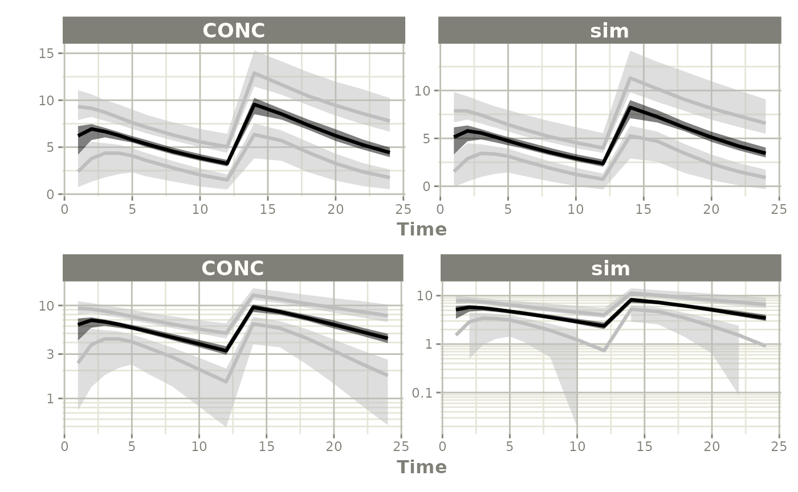

# Simulate using Parameter Uncertainty

This page shows a simple work-flow for directly simulating a different
dosing paradigm than what was modeled taking into account the modeled
uncertainty. This workflow is very similar to simply [simulating without
uncertainty](simulate-new-dosing.md) in the parameters themselves.

## Step 1: Import the model

``` r


library(monolix2rx)
library(rxode2)
# its best practice to set the seed for the simulations
set.seed(42)
rxSetSeed(42)


# You use the path to the monolix mlxtran file

# In this case we will us the theophylline project included in monolix2rx
pkgTheo <- system.file("theo/theophylline_project.mlxtran", package="monolix2rx")

# Note you have to setup monolix2rx to use the model library or save
# the model as a separate file
mod <- monolix2rx(pkgTheo)
#> ℹ integrated model file 'oral1_1cpt_kaVCl.txt' into mlxtran object
#> ℹ updating model values to final parameter estimates
#> ℹ done
#> ℹ reading run info (# obs, doses, Monolix Version, etc) from summary.txt
#> ℹ done
#> ℹ reading covariance from FisherInformation/covarianceEstimatesLin.txt
#> ℹ done
#> Warning in .dataRenameFromMlxtran(data, .mlxtran): NAs introduced by coercion
#> ℹ imported monolix and translated to rxode2 compatible data ($monolixData)
#> ℹ imported monolix ETAS (_SAEM) imported to rxode2 compatible data ($etaData)
#> ℹ imported monolix pred/ipred data to compare ($predIpredData)
#> ℹ solving ipred problem
#> ℹ done
#> ℹ solving pred problem
#> ℹ done

print(mod)
#>  ── rxode2-based free-form 2-cmt ODE model ────────────────────────────────────── 
#>  ── Initalization: ──  
#> Fixed Effects ($theta): 
#>      ka_pop       V_pop      Cl_pop           a           b 
#>  0.42699448 -0.78635157 -3.21457598  0.43327956  0.05425953 
#> 
#> Omega ($omega): 
#>           omega_ka    omega_V   omega_Cl
#> omega_ka 0.4503145 0.00000000 0.00000000
#> omega_V  0.0000000 0.01594701 0.00000000
#> omega_Cl 0.0000000 0.00000000 0.07323701
#> 
#> States ($state or $stateDf): 
#>   Compartment Number Compartment Name
#> 1                  1            depot
#> 2                  2          central
#>  ── μ-referencing ($muRefTable): ──  
#>    theta      eta level
#> 1 ka_pop omega_ka    id
#> 2  V_pop  omega_V    id
#> 3 Cl_pop omega_Cl    id
#> 
#>  ── Model (Normalized Syntax): ── 
#> function() {
#>     description <- "The administration is extravascular with a first order absorption (rate constant ka).\nThe PK model has one compartment (volume V) and a linear elimination (clearance Cl).\nThis has been modified so that it will run without the model library"
#>     dfObs <- 120
#>     dfSub <- 12
#>     thetaMat <- lotri({
#>         ka_pop ~ 0.09785
#>         V_pop ~ c(0.00082606, 0.00041937)
#>         Cl_pop ~ c(-4.2833e-05, -6.7957e-06, 1.1318e-05)
#>         omega_ka ~ c(omega_ka = 0.022259)
#>         omega_V ~ c(omega_ka = -7.6443e-05, omega_V = 0.0014578)
#>         omega_Cl ~ c(omega_ka = 3.062e-06, omega_V = -1.2912e-05, 
#>             omega_Cl = 0.0039578)
#>         a ~ c(omega_ka = -0.0001227, omega_V = -6.5914e-05, omega_Cl = -0.00041194, 
#>             a = 0.015333)
#>         b ~ c(omega_ka = -1.3886e-05, omega_V = -3.1105e-05, 
#>             omega_Cl = 5.2805e-05, a = -0.0026458, b = 0.00056232)
#>     })
#>     validation <- c("ipred relative difference compared to Monolix ipred: 0.04%; 95% percentile: (0%,0.52%); rtol=0.00038", 
#>         "ipred absolute difference compared to Monolix ipred: 95% percentile: (0.000362, 0.00848); atol=0.00254", 
#>         "pred relative difference compared to Monolix pred: 0%; 95% percentile: (0%,0%); rtol=6.6e-07", 
#>         "pred absolute difference compared to Monolix pred: 95% percentile: (1.6e-07, 1.27e-05); atol=3.66e-06", 
#>         "iwres relative difference compared to Monolix iwres: 0%; 95% percentile: (0.06%,32.22%); rtol=0.0153", 
#>         "iwres absolute difference compared to Monolix pred: 95% percentile: (0.000403, 0.0138); atol=0.00305")
#>     ini({
#>         ka_pop <- 0.426994483535611
#>         V_pop <- -0.786351566327091
#>         Cl_pop <- -3.21457597916301
#>         a <- c(0, 0.433279557549051)
#>         b <- c(0, 0.0542595276206251)
#>         omega_ka ~ 0.450314511978718
#>         omega_V ~ 0.0159470121255372
#>         omega_Cl ~ 0.0732370098834837
#>     })
#>     model({
#>         cmt(depot)
#>         cmt(central)
#>         ka <- exp(ka_pop + omega_ka)
#>         V <- exp(V_pop + omega_V)
#>         Cl <- exp(Cl_pop + omega_Cl)
#>         d/dt(depot) <- -ka * depot
#>         d/dt(central) <- +ka * depot - Cl/V * central
#>         Cc <- central/V
#>         CONC <- Cc
#>         CONC ~ add(a) + prop(b) + combined1()
#>     })
#> }
```

## Step 2: Look at a different dosing paradigm

Lets say that in this case instead of a single dose, we want to see what
the concentration profile is with a single day of BID dosing. In this
case is done by creating a [quick event
table](https://nlmixr2.github.io/rxode2/articles/rxode2-event-table.html).

``` r

ev <- et(amt=4, ii=12, until=24) %>%
  et(c(1:6, seq(8, 24, by=2))) %>%
  et(id=1:100)
```

## Step 3: Solve using the uncertainty in the NONMEM model

To use the uncertainty in the model, it is a simple matter of telling
how many times
[`rxode2()`](https://nlmixr2.github.io/rxode2/reference/rxode2.html)
should sample with `nStud=X`. In this case we will use `100`.

``` r

s <- rxSolve(mod, ev, nStud=100)
#> ℹ using locf interpolation like Monolix, specify directly to change
#> ℹ using dfSub=12 from Monolix
#> ℹ using dfObs=120 from Monolix
#> ℹ using thetaMat from Monolix
#> ℹ using Monolix specified atol=1e-06
#> ℹ using Monolix specified rtol=1e-06
#> ℹ Since Monolix doesn't use ssRtol, set ssRtol=100
#> ℹ Since Monolix doesn't use ssRtol, set ssAtol=100
#> ℹ Since Monolix uses a set number of doses for steady state use maxSS=8, minSS=7
#> [====|====|====|====|====|====|====|====|====|====] 0:00:00

s
#> ── Solved rxode2 object ──
#> ── Parameters (x$params): ──
#> # A tibble: 10,000 × 10
#>    sim.id id    ka_pop  V_pop Cl_pop     a      b omega_ka   omega_V  omega_Cl
#>     <int> <fct>  <dbl>  <dbl>  <dbl> <dbl>  <dbl>    <dbl>     <dbl>     <dbl>
#>  1      1 1      0.281 -0.770  -3.22 0.475 0.0653   0.470  -0.208     0.483   
#>  2      1 2      0.281 -0.770  -3.22 0.475 0.0653   0.654   0.0861    0.129   
#>  3      1 3      0.281 -0.770  -3.22 0.475 0.0653  -0.0747  0.168     0.500   
#>  4      1 4      0.281 -0.770  -3.22 0.475 0.0653   0.126  -0.0226    0.479   
#>  5      1 5      0.281 -0.770  -3.22 0.475 0.0653  -0.162   0.000264 -0.205   
#>  6      1 6      0.281 -0.770  -3.22 0.475 0.0653  -1.13   -0.239     0.0941  
#>  7      1 7      0.281 -0.770  -3.22 0.475 0.0653  -0.335   0.0134    0.00490 
#>  8      1 8      0.281 -0.770  -3.22 0.475 0.0653  -0.869  -0.239     0.000511
#>  9      1 9      0.281 -0.770  -3.22 0.475 0.0653   1.35   -0.122     0.667   
#> 10      1 10     0.281 -0.770  -3.22 0.475 0.0653   0.314   0.0494   -0.552   
#> # ℹ 9,990 more rows
#> ── Initial Conditions (x$inits): ──
#>   depot central 
#>       0       0 
#> 
#> Simulation with uncertainty in:
#> • parameters (x$thetaMat for changes)
#> • omega matrix (x$omegaList)
#> • sigma matrix (x$sigmaList)
#> 
#> ── First part of data (object): ──
#> # A tibble: 150,000 × 12
#>   sim.id    id  time    ka     V     Cl    Cc  CONC ipredSim   sim     depot
#>    <int> <int> <dbl> <dbl> <dbl>  <dbl> <dbl> <dbl>    <dbl> <dbl>     <dbl>
#> 1      1     1     1  2.12 0.376 0.0646  8.36  8.36     8.36  8.50 0.481    
#> 2      1     1     2  2.12 0.376 0.0646  8.04  8.04     8.04  9.71 0.0577   
#> 3      1     1     3  2.12 0.376 0.0646  6.90  6.90     6.90  7.77 0.00694  
#> 4      1     1     4  2.12 0.376 0.0646  5.82  5.82     5.82  5.07 0.000833 
#> 5      1     1     5  2.12 0.376 0.0646  4.91  4.91     4.91  4.91 0.000100 
#> 6      1     1     6  2.12 0.376 0.0646  4.13  4.13     4.13  3.79 0.0000121
#> # ℹ 149,994 more rows
#> # ℹ 1 more variable: central <dbl>
```

## Step 4: Summarize and plot

Since there is a bunch of data, a confidence band of the simulation with
uncertainty would be helpful.

One way to do that is to select the interesting components, create a
confidence interval and then plot the confidence bands:

``` r

sci <- confint(s, parm=c("CONC", "sim"))
#> summarizing data...done

sci
#> # A tibble: 90 × 7
#>        p1  time trt    p2.5   p50 p97.5 Percentile
#>     <dbl> <dbl> <fct> <dbl> <dbl> <dbl> <fct>     
#>  1 0.0250     1 CONC  0.741  2.40  4.39 2.5%      
#>  2 0.5        1 CONC  4.21   6.21  7.25 50%       
#>  3 0.975      1 CONC  7.89   9.32 11.1  97.5%     
#>  4 0.0250     2 CONC  1.33   3.80  5.59 2.5%      
#>  5 0.5        2 CONC  5.76   6.94  7.45 50%       
#>  6 0.975      2 CONC  8.22   9.14 10.6  97.5%     
#>  7 0.0250     3 CONC  1.79   4.36  5.42 2.5%      
#>  8 0.5        3 CONC  6.04   6.66  7.05 50%       
#>  9 0.975      3 CONC  7.79   8.71  9.99 97.5%     
#> 10 0.0250     4 CONC  2.12   4.36  5.26 2.5%      
#> # ℹ 80 more rows

p1 <- plot(sci)
#> Warning: `aes_string()` was deprecated in ggplot2 3.0.0.
#> ℹ Please use tidy evaluation idioms with `aes()`.
#> ℹ See also `vignette("ggplot2-in-packages")` for more information.
#> ℹ The deprecated feature was likely used in the rxode2 package.
#>   Please report the issue at <https://github.com/nlmixr2/rxode2/issues/>.
#> This warning is displayed once per session.
#> Call `lifecycle::last_lifecycle_warnings()` to see where this warning was
#> generated.

p2 <- plot(sci, log="y")

library(patchwork)

p1/p2
```


